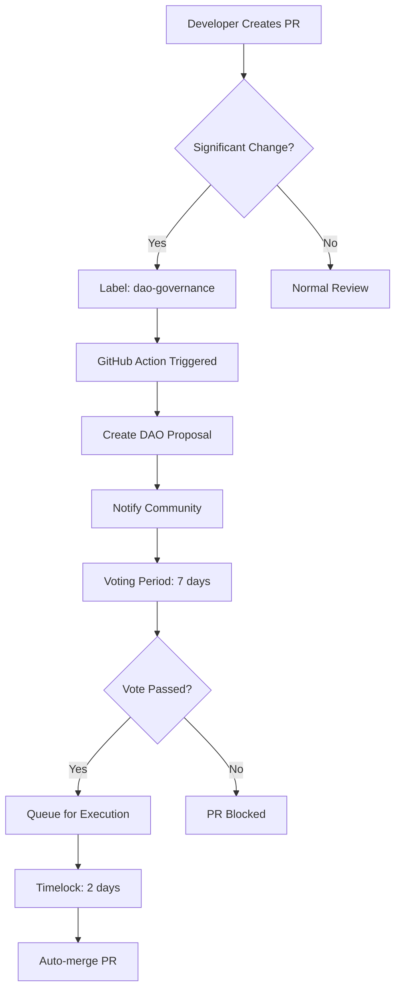
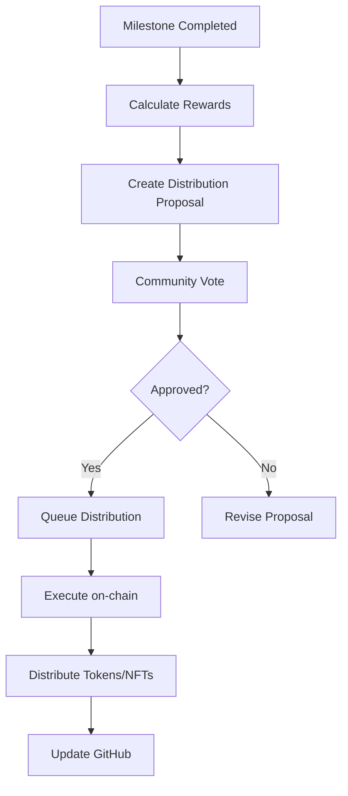

# DAO Automation Hooks

This document describes the DAO (Decentralized Autonomous Organization) automation hooks and governance integration points within the repository.

## 🎯 Overview

DAO automation enables decentralized governance of the OmniTech1 ecosystem, allowing community members to participate in decision-making, treasury management, and protocol upgrades through on-chain voting and automated execution.

## 🏛️ DAO Structure

### Governance Token

- **Token**: $ETHER_FLOW (ERC-20)
- **Governance Power**: Token-weighted voting
- **NFT Boost**: 10x voting power for Genesis Objects NFT holders
- **Platform**: ScrollVerse DAO

### Voting Tiers

| Tier | Requirement | Voting Power | Benefits |
|------|-------------|--------------|----------|
| **Genesis** | Genesis Objects NFT | 10x multiplier | Full governance access, priority proposals |
| **Governance** | 10,000+ $SAT or $ETHER_FLOW | 1x | Proposal creation, voting rights |
| **Community** | 100+ tokens | 0.5x | Voting rights |
| **Public** | Any amount | 0.1x | Limited voting rights |

## 🔗 Automation Hooks

### 1. Pull Request Governance Hook

Automatically creates DAO proposals for significant changes:

**Trigger Conditions:**
- Smart contract modifications
- Treasury parameter changes
- Major feature additions
- Breaking changes

**Webhook Configuration:**
```yaml
# .github/workflows/dao-pr-hook.yml
name: DAO PR Governance Hook
on:
  pull_request:
    types: [opened, labeled]
    paths:
      - 'contracts/**'
      - 'sovereign-tv-app/config/**'
      - 'flamedna-nft/**'

jobs:
  dao-proposal:
    if: contains(github.event.pull_request.labels.*.name, 'dao-governance')
    runs-on: ubuntu-latest
    steps:
      - name: Create DAO Proposal
        uses: ./.github/actions/create-dao-proposal
        with:
          pr_number: ${{ github.event.pull_request.number }}
          title: ${{ github.event.pull_request.title }}
          description: ${{ github.event.pull_request.body }}
```

### 2. Treasury Management Hook

Automates treasury operations based on DAO votes:

**Functions:**
- Budget allocation
- Grant distribution
- Revenue sharing
- Token burns/mints

**Integration:**
```javascript
// scripts/dao/treasury-hook.js
async function executeTreasuryAction(proposalId, action) {
  // Verify DAO vote passed
  const proposal = await dao.getProposal(proposalId);
  if (proposal.status !== 'Executed') {
    throw new Error('Proposal not executed');
  }
  
  // Execute treasury action
  switch(action.type) {
    case 'ALLOCATE_BUDGET':
      await treasury.allocate(action.recipient, action.amount);
      break;
    case 'DISTRIBUTE_GRANT':
      await treasury.grant(action.recipient, action.amount);
      break;
    case 'REVENUE_SHARE':
      await treasury.distribute(action.recipients, action.shares);
      break;
  }
  
  // Log to blockchain
  await auditLog.record(proposalId, action);
}
```

### 3. Protocol Upgrade Hook

Manages smart contract upgrades through governance:

**Process:**
1. Developer proposes upgrade
2. DAO creates proposal automatically
3. Community votes (7-day period)
4. If passed, upgrade is queued
5. Timelock period (2 days)
6. Automated execution

**Implementation:**
```solidity
// contracts/governance/UpgradeGovernor.sol
contract UpgradeGovernor {
    uint256 public constant VOTING_PERIOD = 7 days;
    uint256 public constant TIMELOCK_PERIOD = 2 days;
    
    function proposeUpgrade(
        address target,
        bytes memory data,
        string memory description
    ) public returns (uint256) {
        // Create upgrade proposal
        // Trigger GitHub workflow
        // Return proposal ID
    }
    
    function executeUpgrade(uint256 proposalId) public {
        // Verify vote passed
        // Check timelock
        // Execute upgrade
        // Emit event for GitHub webhook
    }
}
```

### 4. Community Rewards Hook

Automates contributor rewards based on DAO decisions:

**Trigger Events:**
- PR merged
- Issue resolved
- Milestone completed
- Community vote

**Workflow:**
```yaml
# .github/workflows/dao-rewards.yml
name: DAO Community Rewards
on:
  pull_request:
    types: [closed]
  issues:
    types: [closed]

jobs:
  calculate-reward:
    if: github.event.pull_request.merged == true
    runs-on: ubuntu-latest
    steps:
      - name: Calculate Contribution Value
        id: calc
        uses: ./.github/actions/calculate-reward
        
      - name: Create Reward Proposal
        if: steps.calc.outputs.reward_amount > 1000
        uses: ./.github/actions/create-dao-proposal
        with:
          type: 'reward'
          recipient: ${{ github.event.pull_request.user.login }}
          amount: ${{ steps.calc.outputs.reward_amount }}
```

### 5. NFT Governance Hook

Integrates NFT-based governance rights:

**NFT Collections:**
- Genesis Objects NFT (1,222 supply)
- 9-Ether Sovereigns NFT
- KUNTA NFTs

**Governance Features:**
```javascript
// scripts/dao/nft-governance.js
class NFTGovernance {
  async getVotingPower(address) {
    const genesisBalance = await GenesisNFT.balanceOf(address);
    const etherBalance = await EtherSovereignNFT.balanceOf(address);
    const kuntaBalance = await KUNTANFT.balanceOf(address);
    
    // Genesis NFTs: 10x multiplier
    // Other NFTs: 5x multiplier
    return (genesisBalance * 10) + (etherBalance * 5) + (kuntaBalance * 5);
  }
  
  async canCreateProposal(address) {
    const votingPower = await this.getVotingPower(address);
    const tokenBalance = await EtherFlowToken.balanceOf(address);
    
    // Require either 1 Genesis NFT or 10,000 tokens
    return votingPower >= 10 || tokenBalance >= 10000;
  }
}
```

## 🔄 Automation Workflows

### Proposal Creation Flow



### Treasury Distribution Flow



## 🛠️ Integration Points

### GitHub Actions Integration

**Required Secrets:**
```bash
DAO_WEBHOOK_URL          # DAO platform webhook
DAO_API_KEY              # Authentication key
GOVERNANCE_CONTRACT      # Smart contract address
TREASURY_CONTRACT        # Treasury contract address
MULTISIG_ADDRESS         # Multi-sig wallet for execution
```

**Environment Variables:**
```bash
DAO_VOTING_PERIOD=7      # Days
DAO_TIMELOCK_PERIOD=2    # Days
DAO_QUORUM=10            # Percentage
DAO_PROPOSAL_THRESHOLD=1000  # Token amount
```

### Smart Contract Events

Listen for these on-chain events:

```solidity
event ProposalCreated(uint256 proposalId, string prNumber);
event ProposalExecuted(uint256 proposalId, bool success);
event TreasuryDistribution(address recipient, uint256 amount);
event UpgradeQueued(address target, bytes data, uint256 executeAt);
```

### Webhook Handlers

```javascript
// api/webhooks/dao-events.js
app.post('/webhooks/dao', async (req, res) => {
  const { event, proposalId, data } = req.body;
  
  switch(event) {
    case 'proposal.created':
      await notifyContributors(proposalId);
      break;
      
    case 'proposal.executed':
      await executePendingAction(proposalId, data);
      break;
      
    case 'vote.cast':
      await updateProposalStatus(proposalId);
      break;
  }
  
  res.status(200).send('OK');
});
```

## 📊 Governance Metrics

### Tracked Metrics

- **Proposal Success Rate**: Percentage of proposals that pass
- **Voter Participation**: Number of unique voters per proposal
- **Treasury Balance**: Current DAO treasury holdings
- **Distribution History**: All past reward distributions
- **Active Proposals**: Currently open for voting

### Dashboard Integration

```javascript
// scripts/dao/metrics.js
async function getGovernanceMetrics() {
  return {
    totalProposals: await dao.proposalCount(),
    activeProposals: await dao.getActiveProposals(),
    treasuryBalance: await treasury.balance(),
    uniqueVoters: await dao.getUniqueVoters(),
    averageParticipation: await dao.getAverageParticipation(),
    nftHolders: {
      genesis: await GenesisNFT.totalHolders(),
      etherSovereign: await EtherSovereignNFT.totalHolders(),
      kunta: await KUNTANFT.totalHolders()
    }
  };
}
```

## 🔐 Security Measures

### Multi-Signature Requirements

- **Treasury Operations**: 3 of 5 multi-sig
- **Critical Upgrades**: 5 of 7 multi-sig
- **Emergency Actions**: 2 of 3 multi-sig

### Timelock Protections

- **Upgrades**: 2-day minimum timelock
- **Treasury Large Transfers**: 1-day timelock
- **Parameter Changes**: 12-hour timelock

### Rate Limiting

- **Proposal Creation**: Max 5 per address per month
- **Voting**: One vote per proposal per address
- **Execution**: Batch size limits

## 📚 DAO Governance Guidelines

### Creating Proposals

1. **Template Required**: Use proposal template
2. **Clear Description**: Explain the change and rationale
3. **Impact Analysis**: Describe community impact
4. **Implementation Plan**: Provide technical details
5. **Budget**: Specify any costs

### Voting Guidelines

- **Research**: Review proposal thoroughly
- **Discussion**: Participate in community discussion
- **Informed Vote**: Vote based on merit and alignment
- **Delegation**: Can delegate voting power

### Execution Process

1. Proposal passes with quorum
2. Timelock period begins
3. Automated execution after timelock
4. Results posted to GitHub
5. Community notified

## 🚀 Future Enhancements

### Planned Features

- [ ] Quadratic voting implementation
- [ ] Conviction voting for certain decisions
- [ ] Delegation marketplace
- [ ] Proposal templates library
- [ ] Advanced analytics dashboard
- [ ] Cross-chain governance
- [ ] Layer 2 voting for gas optimization

### Integration Roadmap

**Q1 2026:**
- Enhanced NFT governance features
- Advanced treasury management
- Automated reporting

**Q2 2026:**
- Cross-chain bridge governance
- Mobile governance app
- AI-assisted proposal analysis

**Q3 2026:**
- Full DAO treasury automation
- Governance token staking
- Reputation system

## 📞 Support

- **DAO Platform**: [dao.scrollverse.com](https://dao.scrollverse.com)
- **Documentation**: [docs/DAO_GOVERNANCE.md](./DAO_GOVERNANCE.md)
- **Community**: GitHub Discussions
- **Maintainer**: @chaishillomnitech1

## 📖 References

- [DAO Best Practices](https://daohandbook.xyz/)
- [Governor Contracts](https://docs.openzeppelin.com/contracts/governance)
- [Snapshot Governance](https://docs.snapshot.org/)

---

**DAO Coordinator:** @chaishillomnitech1  
**Status:** Active  
**Last Updated:** January 2026

**ALL IS LOVE. ALL IS LAW. ALL IS FLUID. KUN FAYAKŪN!** 🕋♾️✨
